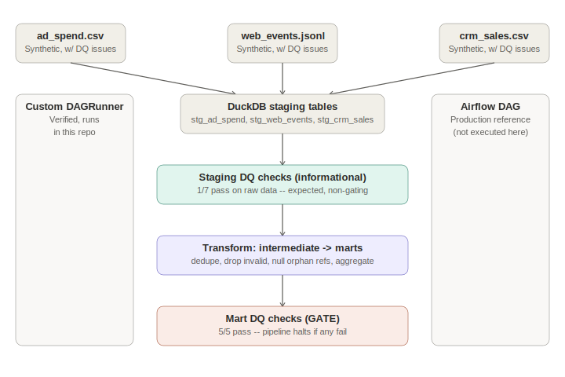

# Marketing Analytics ELT Pipeline

[](.github/workflows/ci.yml)
[](https://www.python.org/)
[](https://duckdb.org/)
[](Dockerfile)
[](LICENSE)
[](tests/test_pipeline.py)

A multi-source marketing analytics ELT pipeline: three synthetic source systems (ad spend, web events, CRM sales) → DuckDB staging → **data quality checks that actually gate the pipeline** → dbt-style layered SQL transformations → BI-ready mart tables. No ML model here — this project is about the data engineering discipline of getting messy multi-source data into a trustworthy warehouse.

---

## Table of contents

- [Business problem](#business-problem)
- [A note on the dataset](#a-note-on-the-dataset)
- [Architecture](#architecture)
- [Project structure](#project-structure)
- [The core idea: data quality gates, not just checks](#the-core-idea-data-quality-gates-not-just-checks)
- [Verifying the gate actually works](#verifying-the-gate-actually-works)
- [Transformation layer](#transformation-layer)
- [Results](#results)
- [Orchestration: custom DAG runner + Airflow reference](#orchestration-custom-dag-runner--airflow-reference)
- [Installation & usage](#installation--usage)
- [Testing & code quality](#testing--code-quality)
- [Deployment](#deployment)
- [What's verified vs. what's scaffolded](#whats-verified-vs-whats-scaffolded)
- [Future work](#future-work)
- [License](#license)
- [Contact](#contact)

---

## Business problem

**Every company running paid marketing needs to answer "which channel is actually working?"** — combining ad spend (Google/Meta/TikTok/LinkedIn), website behavior, and CRM/sales outcomes into one place to compute ROAS, CAC, and funnel conversion. Doing this by hand in spreadsheets doesn't scale and breaks constantly as sources change; dedicated attribution SaaS tools are expensive and often a black box.

**Who faces this:** any company running multi-channel marketing — this is the exact problem behind tools like Triple Whale and Northbeam, and behind countless in-house data engineering builds.

**Current industry approach:** an ELT pipeline — land raw multi-source data, validate it, clean it in a layered SQL transformation (staging → intermediate → marts, the dbt pattern), and serve BI-ready tables to analysts. That's exactly what this project builds.

## A note on the dataset

**This dataset is synthetic, stated plainly.** The build environment couldn't reach real marketing-platform exports, so [`src/ingestion/generate_sources.py`](src/ingestion/generate_sources.py) generates three synthetic source systems instead — deliberately in three different formats (CSV, JSON Lines, CSV), as real multi-source ingestion actually looks.

**Realistic data quality problems are injected on purpose** — not as bugs, but as the entire point of the exercise: duplicate rows (simulating a double-loaded export), orphaned campaign references (a web event tagged with a UTM campaign ID that doesn't exist in the ad spend export — extremely common when someone hand-edits a URL parameter), negative spend values (manual correction entered wrong), and nulls (tracking pixel failures, open CRM deals). A pipeline that only ever sees clean data doesn't demonstrate anything about data quality engineering.

## Architecture



Three source formats → DuckDB staging (raw, unmodified) → informational DQ checks → cleaning transformation → mart tables → gating DQ checks (pipeline halts on fatal failure) → orchestrated by a custom DAG runner, with a production Airflow DAG provided as a reference.

## Project structure

```
marketing-analytics-pipeline/
├── src/
│   ├── ingestion/
│   │   └── generate_sources.py   # 3 synthetic sources w/ injected DQ issues
│   ├── pipeline/
│   │   ├── staging.py             # Raw multi-format load into DuckDB
│   │   ├── transform.py           # staging -> intermediate -> marts (dbt-style)
│   │   ├── dag.py                 # Custom DAG runner: ordering, retries, DQ gate
│   │   └── report.py              # Charts + markdown report from marts
│   └── quality/
│       └── checks.py              # Completeness, uniqueness, referential integrity, range
├── dags/
│   └── airflow_dag.py             # Production Airflow DAG reference (not executed here)
├── tests/
│   └── test_pipeline.py           # 16 tests: DQ checks, transforms, DAG semantics
├── configs/config.yaml
├── docs/
│   ├── architecture.svg
│   ├── dq_report_staging.json     # Generated by the pipeline run
│   ├── dq_report_marts.json       # Generated by the pipeline run
│   ├── dag_run_log.json           # Generated by the pipeline run
│   └── pipeline_report.md         # Generated by src/pipeline/report.py
├── assets/                        # Auto-generated charts
├── data/{raw,warehouse}/          # Generated locally, not committed
├── .github/workflows/ci.yml
├── Dockerfile
├── docker-compose.yml
├── Makefile
├── requirements.txt / requirements-dev.txt
└── pyproject.toml
```

## The core idea: data quality gates, not just checks

Most portfolio ETL projects run a few `assert` statements and call it "data quality." The more important, more realistic pattern is **distinguishing checks that inform from checks that block**:

- **Staging checks are informational only** ([`run_staging_checks`](src/quality/checks.py)) — every one is `severity="warn"`. Raw data is *expected* to have duplicates, orphan references, and invalid values; that's precisely what the transform layer exists to fix. Gating the pipeline at this stage would stop it before the fix ever runs.
- **Mart checks are the real gate** ([`run_mart_checks`](src/quality/checks.py)) — every one is `severity="fail"`. If a mart-level check fails after cleaning, that indicates a genuine bug in the transformation logic, not an expected raw-data quirk, and the pipeline halts loudly (`PipelineFailedError`) rather than silently publishing a broken warehouse.

## Verifying the gate actually works

It's easy to write a check that's *supposed* to gate the pipeline and never actually test that it does. This project verifies it directly: [`tests/test_pipeline.py`](tests/test_pipeline.py) includes `test_gate_failure_stops_downstream_tasks`, which wires up a deliberately failing gate task with a downstream task that must never run, and asserts it doesn't. It also verifies gate failures are **not retried** (`test_gate_failure_is_not_retried`) — retrying a failed data quality gate would just waste time re-running the same broken transform, never fix the underlying issue, whereas a transient failure (e.g. a flaky network call in a real pipeline) genuinely should retry, which is covered by a separate test.

## Transformation layer

Every cleaning decision in [`src/pipeline/transform.py`](src/pipeline/transform.py) is deliberate and logged with an exact row count, not silently applied:

- **Ad spend**: deduplicated by `(campaign_id, date)`, negative-spend rows dropped (24 rows removed on a real run: 19 duplicates + 5 negative values).
- **Web events**: deduplicated by `event_id` (166 removed); orphan campaign references are **nulled out, not dropped** — the page view/signup/purchase still genuinely happened, only the campaign attribution is unreliable, so it becomes "unattributed traffic" rather than being discarded (530 references nulled on a real run).
- **CRM sales**: deduplicated by `deal_id` (3 removed); deals with a missing close date are **flagged as still-open, not dropped** — an open deal is real, ongoing information, not bad data.

## Results

Actual output from a real pipeline run (see `docs/dq_report_staging.json`, `docs/dq_report_marts.json` after running the pipeline):

| Stage | Checks Passed | Notes |
|---|---|---|
| Staging (raw) | 1 / 7 | Expected — these are exactly the issues the transform step fixes |
| Marts (cleaned) | **5 / 5** | The real gate — confirms cleaning actually worked |


Business-facing output from `mart_customer_acquisition_cost` and `mart_channel_performance_daily`:

| Channel | Total Spend | New Customers | CAC |
|---|---|---|---|
| facebook_ads | $35,909.65 | 161 | $223.04 |
| google_ads | $47,766.18 | 181 | $263.90 |
| linkedin_ads | $17,962.04 | 61 | $294.46 |
| tiktok_ads | $23,752.41 | 59 | $402.58 |

**Honest note on ROAS**: since ad spend and purchase revenue were generated independently in the synthetic data (not tuned to produce a flattering story), most channels compute a ROAS below 1.0. That's not a claim about which channel would win in reality — it's evidence the pipeline computes the metric correctly end to end on data that wasn't massaged to look good.

## Orchestration: custom DAG runner + Airflow reference

The **actual, verified pipeline** in this repo runs on a small custom `DAGRunner` ([`src/pipeline/dag.py`](src/pipeline/dag.py)) — topological task ordering, per-task retries with configurable backoff, and the DQ gate described above. It was chosen deliberately over standing up real Apache Airflow, which needs a scheduler, webserver, and metadata database running as persistent background services — out of scope for a sandboxed build environment with no long-running processes.

A structurally faithful **Airflow DAG** is included at [`dags/airflow_dag.py`](dags/airflow_dag.py) as the production deployment reference — same 5 tasks, same dependencies, same DQ gate logic, translated into `PythonOperator`s. It's syntactically valid (verified with `py_compile` in CI) but **not executed** anywhere in this repo's verification — see the note at the top of that file.

## Installation & usage

```bash
git clone <YOUR_GITHUB_URL>.git
cd marketing-analytics-pipeline

python -m venv .venv && source .venv/bin/activate
make install

# Run the full pipeline: generate -> stage -> DQ check -> transform -> gate
make pipeline

# Generate charts + markdown report from the warehouse
make report
```

Or step by step:
```bash
python -m src.ingestion.generate_sources
python -m src.pipeline.staging
python -m src.pipeline.transform
python -m src.pipeline.report
```

Query the warehouse directly:
```bash
python3 -c "
import duckdb
con = duckdb.connect('data/warehouse/marketing.duckdb')
print(con.execute('SELECT * FROM mart_customer_acquisition_cost').df())
"
```

### Via Docker

```bash
docker compose up --build
```
This runs the pipeline as a **batch job** (not a server — there's no port to expose, since the product is the DuckDB warehouse file and the generated reports, mounted out via volumes).

## Testing & code quality

```bash
make test    # pytest, 16 tests: DQ checks, transform correctness, DAG semantics
make lint    # ruff + black --check
```

All 16 tests pass locally, including the DAG-gate verification tests described above. `ruff` and `black` are both clean.

## Deployment

The Dockerfile packages the pipeline as a scheduled batch job — deploy it on a cron-triggered container (AWS ECS Scheduled Tasks, Google Cloud Run Jobs, Azure Container Apps Jobs) or, for a real production orchestration layer, use the Airflow DAG reference in `dags/airflow_dag.py` with a managed Airflow service (MWAA, Cloud Composer, Astronomer).

## What's verified vs. what's scaffolded

**Actually run and verified during development:**
- Data generation (with confirmed injected DQ issues), staging load, both rounds of DQ checks, transformation, and report generation all executed successfully with real output shown above
- The DQ gate mechanism was directly tested by wiring up a deliberately failing gate and confirming downstream tasks never ran
- Retry logic was tested for both transient failures (retries then succeeds) and gate failures (fails immediately, no wasted retries)
- All 16 automated tests pass; `ruff`/`black` both pass clean
- The full pipeline was run clean-room (`rm -rf data/ docs/*.json` then rerun) and reproduced identical results

**Included as production-standard scaffolding, not executed live during development** (no Docker daemon, no persistent-process Airflow scheduler available in the build sandbox):
- `Dockerfile` / `docker-compose.yml` — standard conventions, not build-tested here. Run `docker build .` yourself before relying on it.
- `dags/airflow_dag.py` — syntactically valid (verified via `py_compile`), structurally faithful to the tested custom DAG, but never executed under an actual Airflow scheduler. Treat it as a translation reference, not a tested artifact.
- `.github/workflows/ci.yml` — will genuinely lint/test/build-pass on GitHub given the local results above, but hasn't executed on an actual runner yet.

## Future work

- Swap in real marketing platform exports (Google Ads API, Meta Marketing API, HubSpot/Salesforce CRM export) once available, and re-validate the DQ checks against real-world messiness patterns
- Add incremental/idempotent loading (currently every run rebuilds tables from scratch — fine for a portfolio demo, not for a daily production load of a growing dataset)
- Add data freshness/SLA checks (e.g. "ad_spend must have data for yesterday by 8am")
- Add dbt itself as a direct replacement for the hand-written SQL transformation layer, for lineage visualization and built-in testing
- Add a genuine multi-touch attribution model instead of last-touch (implicit in how `mart_customer_acquisition_cost` currently joins CRM to web events)

## License

MIT — see [LICENSE](LICENSE).

## Contact

**Muhammad Farooq Shafi**
Email: mfarooqsgafee333@gmail.com
LinkedIn: https://www.linkedin.com/in/muhammadfarooqshafi/
GitHub: `<YOUR_GITHUB_URL>`
Facebook: https://www.facebook.com/profile.php?id=61575167257313
